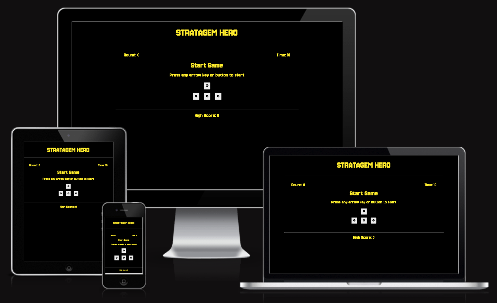
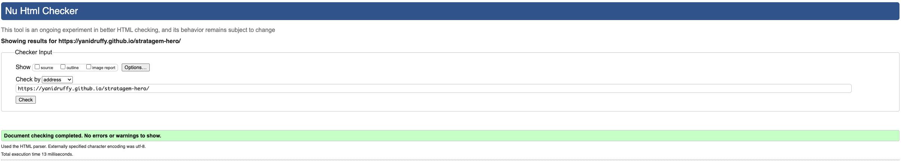
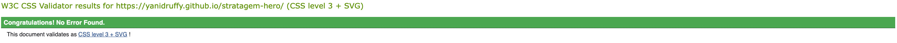
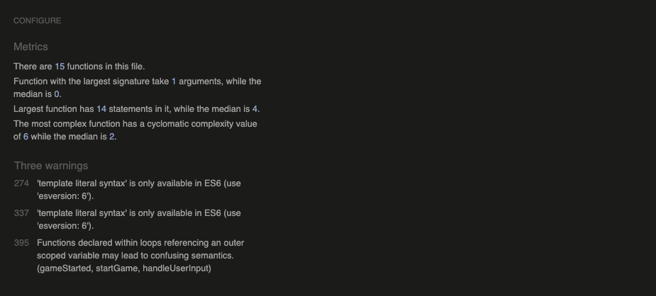
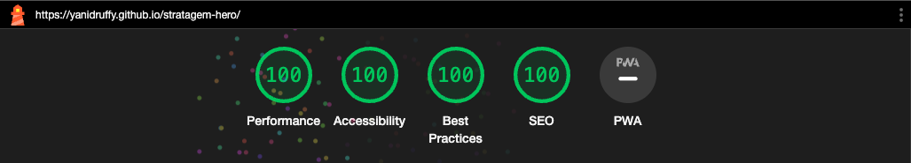

# Stratagem Hero

Welcome to [Stratagem Hero!](https://yanidruffy.github.io/stratagem-hero/) 

## Description
Stratagem Hero immerses you in the Helldiver universe, challenging your reflexes and memory!  
Step into the boots of a Helldiver and utilize diverse stratagems to rescue the day. Enter the precise sequence of arrow key commands to triumphantly execute each stratagem. Your mission? To input the correct sequence swiftly within a constrained time frame and accomplish the stratagem successfully.

## Testing

### Console Logging
During the creation of the website, I extensively used 'console.log()' statements to debug and gain insights of my code behaviour.
Following key aspects were logged:
- Variable States
- Input Handling
- Function Execution
- Game Progression

### HTML Validator
HTML file has been validated using [W3C Markup Validation Service](https://validator.w3.org/)

### CSS Validator
CSS file has been validated using [W3C CSS Validation Service](https://jigsaw.w3.org/css-validator/)

### Javascript Code Analyzer
JS files have been analyzed by using [JSHint](https://jshint.com/) 
During the analysis, both JS files were combined. Three warning messages were flagged by JSHint, but are considered non-critical and can be safely ignored. 

### Responsiveness Test
I have tested the website on its responsiveness using [Google Chrome Dev Tools](https://developer.chrome.com/docs/devtools/) and ui.dev's [amiresponsive](https://ui.dev/amiresponsive).

### Lighthouse
Lighthouse reports have been generated for the website.

#### Desktop

#### Mobile

<!-- https://developer.mozilla.org/en-US/docs/Web/API/UI_Events/Keyboard_event_key_values -->
<!-- https://developer.mozilla.org/en-US/docs/Web/JavaScript/Reference/Global_Objects/String/startsWith -->

<!-- https://www.thegamer.com/helldivers-2-complete-stratagem-button-input-list/#all-patriotic-administration-center-stratagem-inputs -->

<!-- https://www.w3schools.com/jsref/jsref_obj_array.asp -->
<!-- https://www.w3schools.com/js/js_switch.asp -->
<!-- https://www.w3schools.com/howto/howto_js_countdown.asp -->
<!-- https://www.w3schools.com/jsref/met_win_setinterval.asp -->
<!-- https://www.w3schools.com/jsref/met_win_clearinterval.asp -->
<!-- https://www.w3schools.com/jsref/jsref_replace.asp -->
<!-- https://www.w3schools.com/css/css3_transitions.asp -->
<!-- https://www.w3schools.com/jsref/met_win_settimeout.asp -->

<!-- https://www.youtube.com/watch?v=n_ec3eowFLQ -->

<!-- https://ezgif.com/ -->
<!-- https://tinypng.com/ -->

<!-- Mentor Spence big help with how to change color of the symbol to green for better user feedback and docstrings -->
