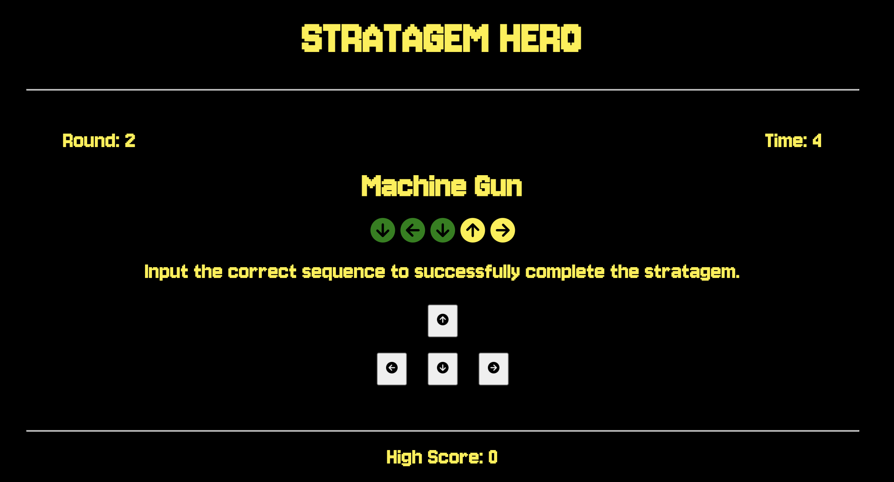
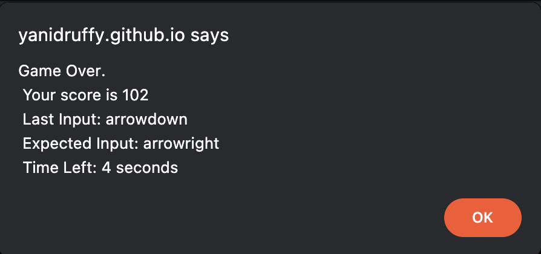
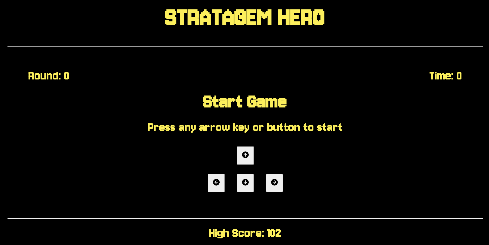
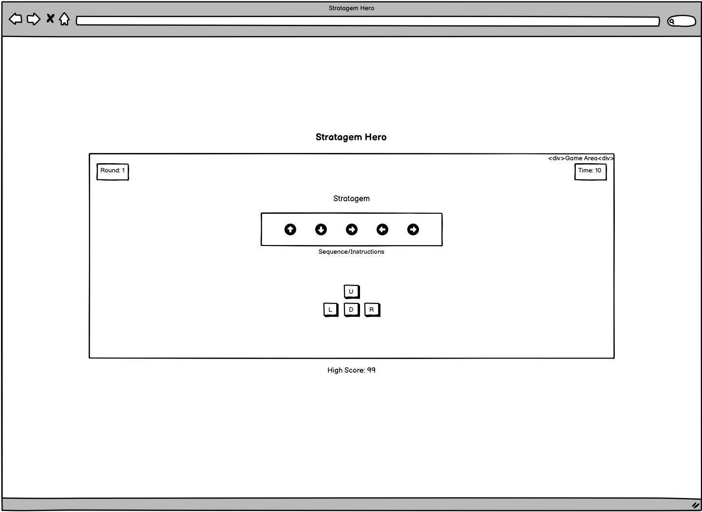
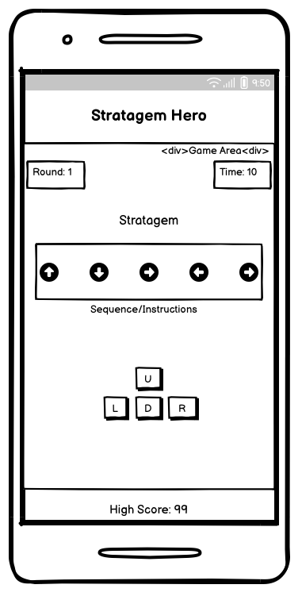
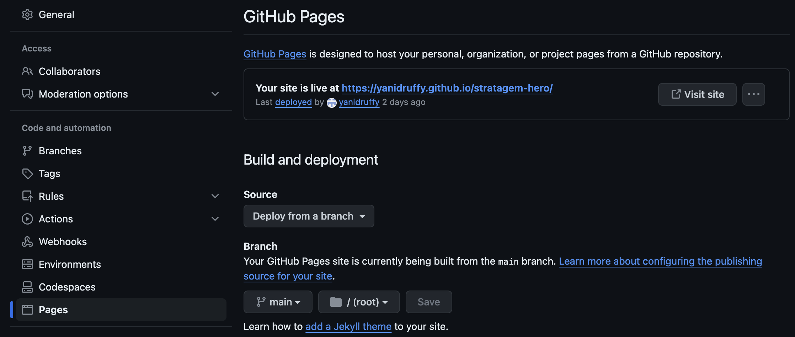

# Stratagem Hero

Welcome to [Stratagem Hero!](https://yanidruffy.github.io/stratagem-hero/) 

## Description
Stratagem Hero immerses you in the Helldiver universe, challenging your reflexes and memory!  
Step into the boots of a Helldiver and utilize diverse stratagems to rescue the day. Enter the precise sequence of arrow key commands to triumphantly execute each stratagem. Your mission? To input the correct sequence swiftly within a constrained time frame and accomplish the stratagem successfully.

## How to Play
1. **Start Game:** Press any arrow key or button to begin the game
2. **Input Stratagems:** Follow the on screen prompts and input the correct sequence to complete each stratagem.
3. **Earn Points:** Successfully input the correct key to earn points and progress through rounds
4. **Beat Your High Score:** Give it your all to achieve the highest score and prove that you are the ultimate Helldiver
5. **Game Over:** Be careful, if you make a mistake or the time runs out, the game will end

## Features

- Variety of stratagems from the Helldivers 2 game
- Responsive controls
- High Score tracking
- Fast paced gameplay
- Increasing difficulty

### One Page Website
All the action happens on one page. The UI is designed to be intuitive and easy to navigate.
### Start of the Game

- **Title**: On the top of the page, players are greeted with the title of the game, Stratagem Hero.
- **Game Area**: The central hub where all the action takes place. Here, players can access critical information such as the current round and remaining time. Clear instructions are provided on how to initiate the game.
- **Input**: For players on mobile devices, a set of arrow keys in the conventional setting as on a keyboard is available.
- **High Score**: Keeping track of the players progress, showcasing the current highest score.

### During the Game

- **Game Area**: Real-time updates on the current round and remaining time. The stratagem as well as it's prompt are showing up. Successfully inputting an arrow key, either through the provided buttons or keyboard input, will highlight the displayed arrow in green, indicating correct execution.

### End of the Game

- **Alert**: In case of time expiration or unsuccessful input, an alert pops up, providing the player with relevant data.

### New Game

- **Game Area**: Reverts to its default state.
- **High Score**: The High Score has been updated, reflecting a new highest score compared to previous records of the current session.

## Wireframes
All wireframes were created using [Balsamiq](https://balsamiq.com/wireframes/). The purpose was to outline the key aspects of the game:
- Responsiveness for Mobile and Desktop
- Game Interface
- Mobile Input

### Desktop:

### Mobile:

## Testing

### Console Logging
During the creation of the website, I extensively used 'console.log()' statements to debug and gain insights of my code behaviour.
Following key aspects were logged:
- Variable States
- Input Handling
- Function Execution
- Game Progression

### HTML Validator
HTML file has been validated using [W3C Markup Validation Service](https://validator.w3.org/)

### CSS Validator
CSS file has been validated using [W3C CSS Validation Service](https://jigsaw.w3.org/css-validator/)

### Javascript Code Analyzer
JS files have been analyzed by using [JSHint](https://jshint.com/) 
During the analysis, both JS files were combined. Three warning messages were flagged by JSHint, but are considered non-critical and can be safely ignored 

### Responsiveness Test
I have tested the website on its responsiveness using [Google Chrome Dev Tools](https://developer.chrome.com/docs/devtools/) and ui.dev's [amiresponsive](https://ui.dev/amiresponsive)

### Lighthouse
Lighthouse reports have been generated for the website

#### Desktop

#### Mobile

## Deployment
The website was deployed using github pages using following method:
- Go to the "Settings" tab of your github repository
- Click on "Pages" on the left column
- Under "Source", select "main" branch
- Click on "Save" to deploy the website
- Once successfully deployed, a message with the live link will appear

## Credits
### Content
- The Font used is from [Google Fonts](https://fonts.google.com/)
- The color palette is from [Coolors](https://coolors.co/)
- The icons are from [Font Awesome](https://fontawesome.com/)
- The favicons are from [Favicon](https://favicon.io/)
- The stratagems are originally from Helldivers II, however the data I used is from [The Gamer](https://www.thegamer.com/helldivers-2-complete-stratagem-button-input-list/#all-patriotic-administration-center-stratagem-inputs)

### References
- The layout and Keyboard Events are inspired by Code Institute and their [Love Maths](https://github.com/Code-Institute-Solutions/love-maths-2.0-sourcecode) project
- [FreeCodeCamp's](https://www.youtube.com/watch?v=n_ec3eowFLQ) video about the Simon says game, helped me with my game logic
- [MDN Web Docs](https://developer.mozilla.org/en-US/) and [W3Schools](https://www.w3schools.com/jsref/) with their explanations and tutorials were invaluable - link to more can be found in the raw file
- I used my previous project [Protein Kitchen](https://github.com/yanidruffy/protein-kitchen) to help me create this readme file

### Media
- The image to demonstrate the websites responsiveness was created using [amiresponsive](https://ui.dev/amiresponsive
)
- The arrow icons were taken from [Font Awesome](https://fontawesome.com/) as svg files 
-> I converted these files to images using [ezgif](https://ezgif.com/) 
-> The images were resized using [Tinify](https://tinypng.com/)

### Acknowledgements
- Special thanks goes to Arrowhead Game Studios for creating Helldivers II, the inspiration behind this project
- Shoutout to my mentor Spence who provided invaluable guidance on improving user feedback and the use of docstrings
- Thank you to my Cohort Facilitator Kristyna and my colleagues

<!--
MDN Web Docs and W3Schools credits:
https://developer.mozilla.org/en-US/docs/Web/API/UI_Events/Keyboard_event_key_values
https://developer.mozilla.org/en-US/docs/Web/JavaScript/Reference/Global_Objects/String/startsWith
https://www.w3schools.com/jsref/jsref_obj_array.asp
https://www.w3schools.com/js/js_switch.asp
https://www.w3schools.com/howto/howto_js_countdown.asp
https://www.w3schools.com/jsref/met_win_setinterval.asp
https://www.w3schools.com/jsref/met_win_clearinterval.asp
https://www.w3schools.com/jsref/jsref_replace.asp
https://www.w3schools.com/css/css3_transitions.asp
https://www.w3schools.com/jsref/met_win_settimeout.asp
-->
